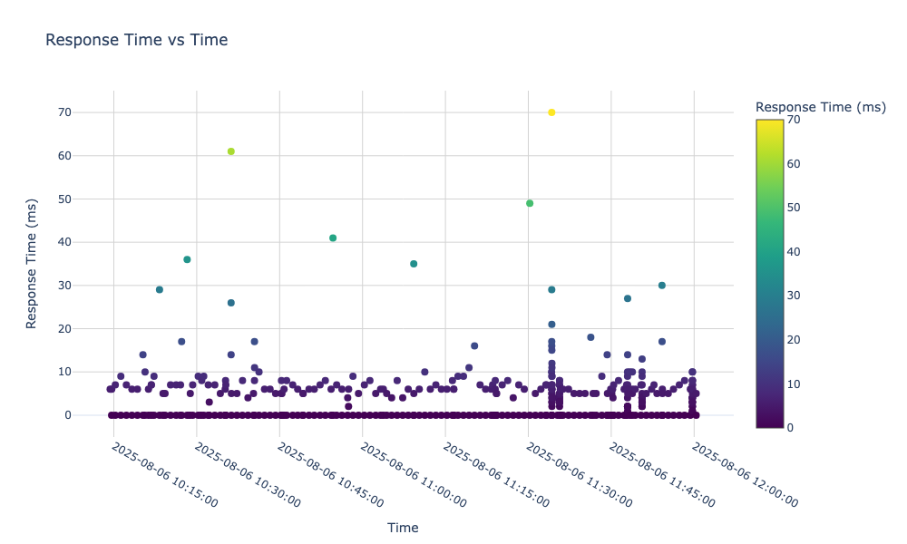

This is a command-line tool with the goal of being able to plot anything.

It takes (a) some data, and (b) a natural-language description of what it should plot, and it uses an LLM to quickly synthesize a script to plot that data in the desired way.

# Usage

Usage:

    anyplot INSTRUCTIONS [PATH]

Example:

    $ head -n3 examples/server-logs.txt
    2025-08-06T10:14:20Z clientIP="snip" requestID="22bb7385-6bee-45ed" responseTimeMS=6 responseBytes=3629 userAgent="Mozilla/5.0 (compatible; Company-Analyzer/1.0)"
    2025-08-06T10:14:36Z clientIP="snip" requestID="" responseTimeMS=0 responseBytes=127 userAgent="Mozilla/5.0 (iPhone; CPU iPhone OS 13_2_3 like Mac OS X) AppleWebKit/605.1.15 (KHTML, like Gecko) Version/13.0.3 Mobile/15E148 Safari/604.1"
    2025-08-06T10:14:37Z clientIP="snip" requestID="7812c320-fcc4-4f9c" responseTimeMS=6 responseBytes=3629 userAgent="Mozilla/5.0 (iPhone; CPU iPhone OS 13_2_3 like Mac OS X) AppleWebKit/605.1.15 (KHTML, like Gecko) Version/13.0.3 Mobile/15E148 Safari/604.1"
    $ anyplot 'scatter plot of responseTimeMS vs time' examples/server-logs.txt

# Caching

In order to avoid unnecessarily resynthesizing scripts, Anyplot remembers all of the scripts that it's written, along with the associated instructions and data-fingerprint. If you run it again with the same instructions and sufficiently-similar-looking data, it'll use the existing script, no LLM calls required.

Example:

    $ python3 -c 'from random import normalvariate as nv; [print(nv(), nv()) for _ in range(1000)]' > data.txt
    $ head -n2 data.txt
    -0.4268935686045415 0.13028752451693063
    -1.763583534658493 -0.8041329927714401

    $ anyplot scatter data.txt  # first run: needs to write the script
    No cached script found; finding representative lines...
    <...snip...>
    Executing: ~/.cache/anyplot/scripts/435444d3f941b30bac5cb777ea3762df61182bf5f3a8576e9839bb4ba8c1aca4.py

    $ anyplot scatter data.txt  # re-run with same data: uses existing script
    Executing: ~/.cache/anyplot/scripts/435444d3f941b30bac5cb777ea3762df61182bf5f3a8576e9839bb4ba8c1aca4.py

    $ python3 -c 'from random import normalvariate as nv; [print(nv(), nv()) for _ in range(1000)]' > data.txt
    $ head -n2 data.txt
    2.2678682154776793 -0.653177282888232
    -2.0490451614830945 -0.5921683028750352

    $ anyplot scatter data.txt  # new data, but very similar-looking; uses existing script
    Executing: ~/.cache/anyplot/scripts/435444d3f941b30bac5cb777ea3762df61182bf5f3a8576e9839bb4ba8c1aca4.py
